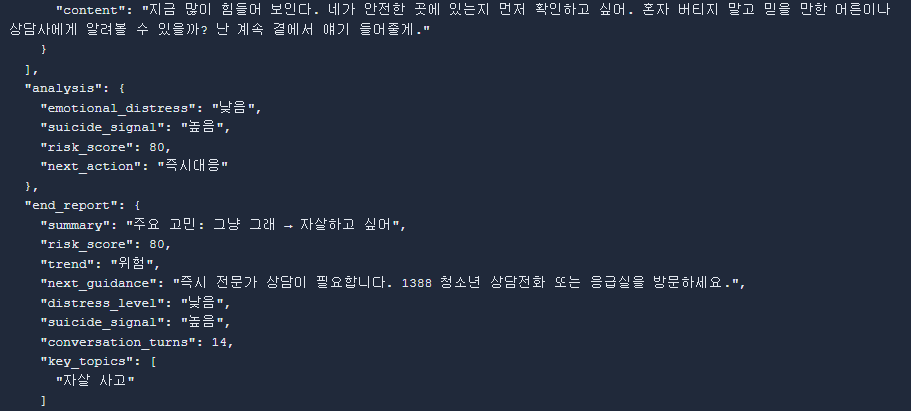
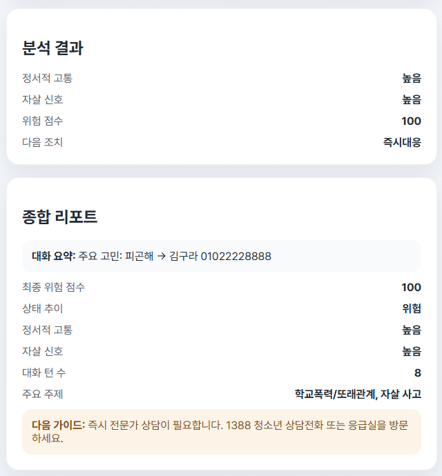

<div align="center">
  
  <h1>SORI</h1>
  <p>"한 단어부터 시작해도 괜찮아" — 학생의 마음 상태를 대화로 살피고,<br/>위험 신호가 보이면 놓치지 않는 정서 지원 에이전트</p>

  <p>
    
    
    
    
  </p>
</div>

---

## 왜 만들었나

학생들이 힘든 일이 있어도 먼저 말을 꺼내기가 어렵다는 이야기를 듣고 시작한 프로젝트입니다. 감정이 없어서가 아니라, 그걸 꺼낼 "시작점"이 없다는 게 진짜 문제라고 생각했어요. 그래서 정확한 문장으로 말하지 못해도, 한 단어만 눌러도 대화가 자연스럽게 이어지도록 설계했습니다.


실제로 청소년 고립·은둔 관련 통계와 정서 표현 연구를 찾아보면서, 또래 관계에 대한 부담 때문에 오히려 감정을 숨기는 경우가 많다는 근거도 확인했습니다.


## 어떻게 풀었나

상담사처럼 "말씀해보세요" 하는 톤이 아니라, 친구가 옆에서 들어주는 듯한 톤을 목표로 잡았습니다. 판단하거나 조언하지 않고, 학생이 한 말을 한 번 더 반영해주면서 다음 질문으로 자연스럽게 이어가는 방식이에요.


캐릭터도 말투와 같은 방향으로 맞췄습니다. 부담스럽지 않은 둥근 캐릭터, 자극적이지 않은 푸른 계열 색상으로요.


## 에이전트가 돌아가는 방식

대화 한 턴이 들어올 때마다 SORI 내부에서는 이런 순서로 처리됩니다.

1. **상태 판단** — 지금까지의 대화를 보고 정서적 고통 수준, 자살 신호, 위험 점수를 규칙 기반으로 계산
2. **RAG 검색** — 위험도에 따라 학생 자살 위기 대응 매뉴얼에서 관련 내용을 검색
3. **응답 생성** — 판단 결과 + 매뉴얼 내용을 GPT-4o-mini에 전달해서 친구 톤의 답변을 생성
4. **기록** — 매 턴의 분석 결과를 대화 로그에 함께 저장

처음 설계할 때 그린 그림은 이렇습니다.


> 그림에는 PostgreSQL이 있지만, 실제로 구현할 때는 훨씬 가벼운 방식이 필요하다고 판단해서 대화 저장을 **JSON 파일 기반**([storage.py](backend/app/storage.py))으로 바꿨습니다. 아래 [실제 아키텍처](#실제-아키텍처) 참고.

LLM이 스스로 위험도를 판단하게 두지 않고, 판단은 규칙 기반 로직이 먼저 하고 LLM은 그 판단을 바탕으로 "어떻게 말할지"만 담당하게 역할을 나눈 게 핵심입니다. 감정 케어처럼 안전이 중요한 도메인에서는 LLM에게 판단까지 전부 맡기면 안 된다고 생각했어요.

## RAG는 왜, 어떻게 붙였나

GPT가 알아서 답하게 두면 임의로 판단하거나 상황에 안 맞는 조언을 할 수 있어서, 실제 위기 대응 매뉴얼을 근거로 쓰게 만들고 싶었습니다.


매뉴얼 PDF를 전처리해서 의미 단위로 쪼개고(chunking), ChromaDB에 임베딩으로 저장한 다음, 위험도가 높다고 판단될 때 관련 청크만 검색해서 LLM 프롬프트에 참고 자료로 끼워 넣는 구조입니다. RAG가 답을 대신 정해주는 게 아니라, LLM이 참고할 근거를 보태주는 역할까지만 하도록 선을 그었습니다.

## 프롬프트도 그냥 던지지 않았다

LLM 역할을 "친구 같은 대화 상대"로 못 박아두고, 상담사·의료인처럼 판단하는 역할은 못하게 프롬프트로 제한했습니다. 상태 분석 결과와 RAG 검색 결과를 함께 넘겨서, 위험도에 따라 응답 강도가 달라지게 했고요.


응답은 항상 정해진 JSON 스키마로 나오게 해서, 프론트엔드/관리자 화면과 안정적으로 연결되도록 했습니다.

## 실제 화면

말로 설명한 것들이 실제로 어떻게 보이는지 화면으로 보면 이렇습니다.

**첫 화면** — 무슨 말을 해야 할지 고민하지 않게, 버튼 몇 개로 바로 대화를 시작할 수 있게 했습니다.


**대화 화면** — 학생 쪽에는 위험 점수나 분석 결과를 절대 보여주지 않습니다. 오직 대화에만 집중할 수 있게요.


**관리자 대시보드** — 저장된 모든 대화를 한눈에 보고, 어떤 대화가 위험했는지 바로 확인할 수 있습니다.


**대화 상세 분석** — 특정 대화를 열면 턴별 위험 점수 추이와 주요 고민이 정리돼서 보입니다.


**관리자 화면의 JSON 뷰** — 평가/검증용으로 각 턴의 원본 분석 결과를 그대로 볼 수 있게 열어뒀습니다.




**종합 리포트** — 대화가 끝나면 위험 점수, 상태 추이, 다음 가이드가 담긴 리포트가 자동으로 생성됩니다.



**대화 종료 화면** — 학생에게는 점수나 판단 결과 대신, 안전 확인과 도움받을 수 있는 연락처만 담백하게 보여줍니다.


## 아직 부족한 부분

만들면서 한계도 분명히 보였습니다.


규칙 기반 판단이라 표현이 애매하면 정확도가 떨어지고, 지금은 한 번의 대화 안에서만 판단하기 때문에 여러 날에 걸친 감정 변화는 못 봅니다. 다음에 손댄다면 대화 히스토리를 길게 쌓아서 추세를 보는 방향, 그리고 학생마다 감정 표현 방식이 다른 걸 반영해서 개인화하는 방향으로 가보고 싶습니다.

## 실제 아키텍처

기획 단계 그림과 다르게, 실제로 돌아가는 구조는 이렇습니다.

```
User ⇄ Frontend(React) ⇄ Backend(FastAPI)
                              │
                              ├─ 규칙 기반 정서/위기 분석 (agent.py)
                              │     └─ 정서 고통 수준 · 자살 신호 · 위험 점수 산출
                              │
                              ├─ RAG 검색 (rag.py + ChromaDB)
                              │     └─ 위기 대응 매뉴얼에서 관련 청크 검색
                              │
                              ├─ LLM 응답 생성 (llm.py, GPT-4o-mini)
                              │     └─ 페르소나 + RAG 컨텍스트 기반 응답
                              │
                              └─ 대화 저장 (storage.py)
                                    └─ JSON 파일로 대화/분석/리포트 기록
```

OPENAI_API_KEY가 없으면 LLM 호출 없이 규칙 기반 응답으로 자동 폴백합니다.

## 기술 스택

| 영역 | 기술 |
| --- | --- |
| Backend | FastAPI, Pydantic, Uvicorn |
| Frontend | React 18, Vite |
| LLM | OpenAI `gpt-4o-mini` (Chat Completions API) |
| RAG | ChromaDB (로컬 벡터 DB) |
| 대화 저장 | JSON 파일 기반 (`backend/data/conversations/`) |

## 직접 실행해보기

### 1) Backend

```bash
cd backend
python -m venv .venv
.venv\Scripts\activate
pip install -r requirements.txt
```

`backend/.env` 파일을 만들고 아래 내용을 채워주세요.

```env
OPENAI_API_KEY=sk-...
OPENAI_MODEL=gpt-4o-mini
```

```bash
uvicorn app.main:app --reload --port 8000
```

**RAG DB 초기화 (선택)** — 위기 대응 매뉴얼을 벡터 DB로 만들려면:

```bash
python init_rag_db.py
```

- 저장 위치: `backend/data/chroma_db/` (Git에는 포함되지 않음, `.gitignore` 처리됨)

### 2) Frontend

```bash
cd frontend
npm install
npm run dev
```

브라우저에서 `http://localhost:5173` 접속. (`vite.config.js`의 `proxy` 설정으로 `/api` 요청이 백엔드로 전달됩니다. 8000번 포트가 다른 프로세스에 이미 점유돼 있다면 백엔드/`vite.config.js` 포트를 함께 바꿔주세요.)

## API

| Method | Endpoint | 설명 |
| --- | --- | --- |
| POST | `/api/chat` | 대화 메시지 전송, 정서/위기 분석 및 응답 반환 |
| GET | `/api/rag/info` | RAG DB 정보 (저장 위치, 청크 개수 등) |
| GET | `/api/admin/conversations` | 저장된 대화 목록 조회 |
| GET | `/api/admin/conversations/{filename}` | 특정 대화 상세 조회 |
| GET | `/health` | 헬스 체크 |

`POST /api/chat` 요청/응답 예시:

```json
// Request
{ "history": [{ "role": "user", "content": "..." }], "message": "...", "is_admin": false }

// Response
{
  "reply": "많이 힘들었겠구나. 어떤 상황이었는지 조금 더 말해줄래?",
  "emotional_distress": "높음",
  "suicide_signal": "낮음",
  "risk_score": 45,
  "next_action": "주의환기",
  "conversation_end": false,
  "end_report": null
}
```

## 관리자 모드로 확인하기

1. 랜딩 페이지에서 "관리자 로그인" 클릭
2. 아이디 `admin` / 비밀번호 `1234` (데모용 임시 계정)로 로그인
3. 채팅 화면의 "상태 대시보드" 패널에서 실시간 분석 결과 확인
4. "JSON 보기" 버튼으로 각 턴의 원본 분석 JSON 확인

학생 화면은 AI 답변만 보여주고, 관리자 화면에서만 정서/위기 분석 정보와 JSON 출력을 볼 수 있습니다.

## Windows에서 막히는 부분들

<details>
<summary>펼쳐서 보기</summary>

**PowerShell에서 가상환경/npm 스크립트 실행이 막힐 때**

```powershell
Set-ExecutionPolicy -Scope Process -ExecutionPolicy Bypass
.\.venv\Scripts\Activate.ps1   # 또는 npm run dev
```

**`uvicorn` 명령어를 인식하지 못할 때**

```powershell
python -m uvicorn app.main:app --reload --host 0.0.0.0 --port 8000
```

**포트 충돌 (`[WinError 10048]`)**

```powershell
netstat -ano | findstr :8000
taskkill /F /PID <PID>
```

**백엔드 500 에러 + `UnicodeEncodeError: 'cp949'`**

Windows 콘솔 기본 인코딩(cp949) 때문에 이모지 출력이 실패할 수 있습니다. 로그에는 이모지 대신 `[WARN]`, `[ERR]` 같은 ASCII 문자열만 사용하세요.

</details>

## 참고 자료

- [학생자살위기대응_매뉴얼.txt](docs/학생자살위기대응_매뉴얼.txt) — RAG의 근거 데이터로 사용되는 위기 대응 매뉴얼
</content>
